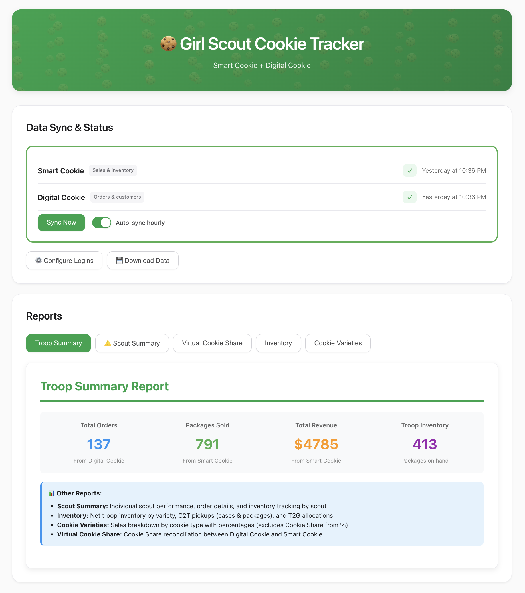

# Girl Scout Cookie Tracker

Desktop app for Girl Scout troops to sync and manage cookie sales from Digital Cookie and Smart Cookie.

## Features

- ✅ **One-Click Sync** - Automatically download data from both platforms
- 🔄 **Auto-Sync** - Syncs every hour automatically
- 📊 **5 Reports** - Troop summary, scout performance, inventory, varieties, and donations
- 🔒 **Secure** - Credentials encrypted on your computer
- 📦 **Inventory Tracking** - Track troop and scout inventory

## Installation

**Download the latest version from [Releases](https://github.com/tyleryates/cookie-tracker/releases/latest)**

1. Download the `.zip` file
2. Extract it
3. Drag the app to your Applications folder
4. Double-click to open

The app will automatically check for updates and notify you when new versions are available.

## Getting Started

1. **Launch the app**

2. **Click "Configure Logins"** and enter your credentials:
   - Digital Cookie: Username and password
   - Smart Cookie: Username and password

3. **Click "Sync Now"** - Wait for your data to download

4. **View Reports** - Click any report button to see your data

That's it! The app will automatically sync every hour.

## Reports

- **Troop Summary** - Total orders, packages sold, revenue, and inventory
- **Scout Summary** - Individual scout performance and order details
- **Inventory** - Troop inventory by cookie variety
- **Cookie Varieties** - Sales breakdown by cookie type
- **Virtual Cookie Share** - Donation tracking

## Settings

### Auto-Sync

The app syncs every hour automatically. You can:
- Turn it off by unchecking "Auto-sync hourly"
- Sync manually anytime by clicking "Sync Now"

### Council ID

The app is set for **Girl Scouts San Diego (Council 623)**.

If your troop is in a different council, you'll need to update the council ID in Configure Logins. Your council ID is in the URL when you log into Digital Cookie.

## Privacy

All data stays on your computer. Nothing is sent anywhere except to the Girl Scouts websites when you click Sync.

## Help

**Having issues?**
- Try clicking "Sync Now" again
- Make sure your login credentials are correct
- Check your internet connection

**Still need help?**
[Report an issue on GitHub](https://github.com/tyleryates/cookie-tracker/issues)

## For Developers

See **[DEVELOPMENT.md](DEVELOPMENT.md)** for technical documentation.

---

**Version:** 1.2.0

This is an unofficial volunteer tool not affiliated with Girl Scouts of the USA.
